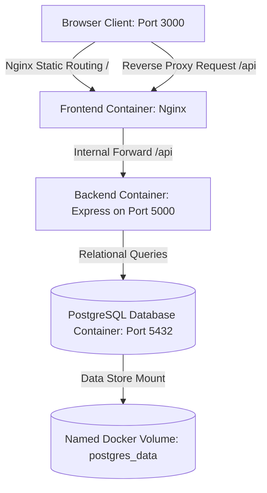

# Student Management DevOps Deployment Portfolio

A premium, production-grade **Student Management Web Application** engineered specifically as a DevOps showcase. This repository replicates a high-fidelity administrative dashboard (featuring student registry management, dynamic enrollment metrics, and system log auditing) and wraps it inside an enterprise-grade containerization and deployment architecture.

---

## 🚀 Key DevOps & Systems Features

1. **Multi-Stage Containerization**: 
   - **Frontend**: Double-stage Dockerfile (Node compiling environment ➡️ Alpine Nginx production host). This structure keeps frontend image sizes under 25MB!
   - **Backend**: Secure Debian `node:20-slim` container hosting our Express REST API.
2. **Nginx Reverse Proxy routing**: Serves client-side static bundles and routes all API endpoints under `/api/*` to the Node.js backend internally, completely eliminating browser CORS concerns and securing endpoint access.
3. **Database-Agnostic Hybrid Adapter**:
   - **Local Developer Loop**: Boots immediately in zero-dependency **SQLite** local storage mode.
   - **Production/Docker Mode**: Automatically switches to a **PostgreSQL** relational cluster driven by environment configurations.
4. **Docker Compose Orchestration**: Connects Postgres, API backend, and Nginx front-facing client into a single isolated bridge network with service volume mounts for total data persistence and database boot health checks.
5. **GitHub Actions CI/CD Pipeline**: Linting, frontend bundle verification, and multi-platform container compilation checks on push/pull-request to `main` branch.

---

## 🏗️ Architecture Design



---

## 📂 Repository File Structure

```
Stu_Mang/
├── backend/                  # Node.js/Express API Server
│   ├── src/
│   │   ├── routes/api.js     # Express CRUD & analytics router
│   │   ├── db.js             # SQLite / Postgres database manager
│   │   └── index.js          # Express entrypoint
│   ├── Dockerfile            # API container specification (node:20-slim)
│   └── package.json
├── frontend/                 # React administrative dashboard client
│   ├── src/
│   │   ├── components/       # Layouts, tables, interactive SVGs, forms
│   │   ├── styles/           # index.css design system
│   │   └── App.jsx           # Stateful SPA router & views
│   ├── index.html            # SEO meta configurations
│   ├── nginx.conf            # Production-grade routing & reverse proxy
│   └── Dockerfile            # Multi-stage image build instructions
├── .github/
│   └── workflows/
│       └── ci-cd.yml         # CI/CD validation & deployment pipeline
├── docker-compose.yml        # Multi-container local execution setup
├── .gitignore                # Git workspace safety filters
└── README.md                 # Project handbook
```

---

## 🛠️ How to Run Locally

### Approach 1: Rapid Development Run (No Docker Required)
Perfect for tweaking styles and immediate visual hot-reloading.

1. **Start the Express API Backend**:
   ```bash
   cd backend
   npm install
   npm start
   ```
   *The backend will automatically create a local `database.sqlite` file and seed it with the default datasets matching your screenshot.*

2. **Start the Vite React Frontend**:
   ```bash
   cd ../frontend
   npm install
   npm run dev
   ```
   *Open [http://localhost:5173](http://localhost:5173) in your browser. The frontend dynamically communicates with the backend, managing students and rendering metrics.*

---

### Approach 2: Full DevOps Containerized Run (Recommended)
Demonstrates multi-container microservice orchestration exactly like production deployments.

Make sure you have Docker running on your machine, then run:
```bash
docker compose up --build -d
```

#### What happens behind the scenes:
1. Docker builds a local isolated network `student_network`.
2. A PostgreSQL database container starts up, sets up access parameters, and mounts `postgres_data` volume.
3. The backend container compiles and holds until PostgreSQL database reports healthy status. It then seeds Postgres with default records.
4. The React client builds, compiles to static HTML/CSS/JS, and mounts into Nginx.
5. Access the full application at **[http://localhost:3000](http://localhost:3000)**!

#### Verify Data Persistence:
- Add a new student registration through the interface.
- Terminate the cluster: `docker compose down`.
- Start it back up: `docker compose up -d`.
- Notice all students and activities remain preserved, surviving container lifecycle destructions!

---

## 🛡️ Production & Cloud Deployment Guide

To deploy this architecture to a cloud provider like **AWS EC2**:

1. **Deploy a Cloud Instance**:
   - Provision an AWS EC2 instance running Ubuntu Server 22.04 LTS.
   - Associate a security group allowing HTTP inbound traffic on port `80` (or `3000`) and SSH on port `22`.

2. **Prepare Environment**:
   - SSH into the instance: `ssh -i key.pem ubuntu@your-ec2-ip`
   - Install Docker and Docker Compose on the instance:
     ```bash
     sudo apt-get update
     sudo apt-get install -y docker.io docker-compose
     sudo systemctl start docker
     sudo systemctl enable docker
     ```

3. **Deploy Codebase**:
   - Clone the git repository to the instance, or copy files using `scp`.
   - Update `docker-compose.yml` to bind the Frontend container's port directly to `80:80` instead of `3000:80` to expose the web app over standard public HTTP.
   - Spin up the containers:
     ```bash
     sudo docker-compose up -d --build
     ```
   - Open your browser and navigate to `http://your-ec2-ip` to interact with your live cloud-deployed Student Management System dashboard!

---

## 📈 Dashboard Data & Features Summary
- **Stat Cards**: Dynamic cards showing total active counts, male/female enrollment fractions, and total unique course pathways.
- **Donut/Pie Analytics**: A dynamic SVG donut chart reflecting the course allocations (B.Tech, BCA, B.Sc, B.Com, MBA) updating in real-time as registrations change.
- **Audited Activities**: Responsive logger capturing student modifications (additions, information updates, deletions) with matching badge indicators and system timestamps.
- **Data Exporting**: "Export Student Dataset" button exports the full database registry directly into download-ready CSV reports.
